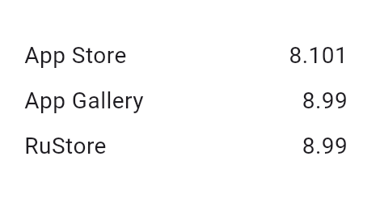

<!--
This README describes the package. If you publish this package to pub.dev,
this README's contents appear on the landing page for your package.

For information about how to write a good package README, see the guide for
[writing package pages](https://dart.dev/guides/libraries/writing-package-pages).

For general information about developing packages, see the Dart guide for
[creating packages](https://dart.dev/guides/libraries/create-library-packages)
and the Flutter guide for
[developing packages and plugins](https://flutter.dev/developing-packages).
-->

# flutter_update_checker

[](https://pub.dev/packages/flutter_update_checker)
[](https://pub.dev/packages/flutter_update_checker/score)

Simple package to check update for Android (Google Play, App Gallery, RuStore) and iOS (AppStore).  

It helps developers notify users about new versions of the app, ensuring that they always have the latest features and bug fixes.

[Feedback](https://github.com/adictgroup/flutter_update_checker/issues) and [Pull Requests](https://github.com/adictgroup/flutter_update_checker/pulls) are most welcome!




## Features

1. Getting the version/checking update from the store where the application was downloaded  
1. Getting a version from another store (except Google Play*)
1. Opening link to store

## Platform support

| Feature                        | Android           | iOS |
| ------------------------------ | :---------------: | :-: |
| App Store                      | ✅                | ✅  |
| App Gallery                    | ✅                | ✅  |
| Google Play                    | (Only if from GP)* |   |
| RuStore                        | ✅                | ✅  |

\* Please note that this Google Play update check cannot be tested locally. You must install the app through Google Play to use it. Please refer to the official documentation on in-app updates from Google:

https://developer.android.com/guide/playcore/in-app-updates/test

## Requirements
* Android >=5 (API >=21)
* iOS >=12

## Getting started

For iOS you have to add LSApplicationQueriesSchemes as Array param to Info.plist and add itms-apps as one of params in this array to link appstore.

Code:
```xml
<key>LSApplicationQueriesSchemes</key>
<array>
  <string>itms-apps</string>
</array>
```

Use Semantic Versioning (X.Y.Z) in `pubspec.yaml`
```yaml
version: 1.2.3+XXXXXX
```


## Usage

Check example
in `/example` folder.

```dart
import 'package:flutter_update_checker/flutter_update_checker.dart';

final updateChecker = UpdateStoreChecker(
      iosAppStoreId: 564177498,
      androidAppGalleryId: 'C101104117',
      androidAppGalleryPackageName: 'com.vkontakte.android',
      androidRuStorePackage: 'com.vkontakte.android',
      androidGooglePlayPackage: 'com.vkontakte.android',
    );

// Check update
bool isUpdateAvailable = await updateChecker.checkUpdate();

// Get version from Store
String storeVersion = await updateChecker.getStoreVersion();

// Open Store Link
await updateChecker.update();
```